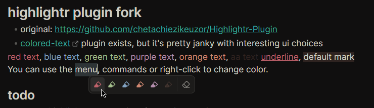
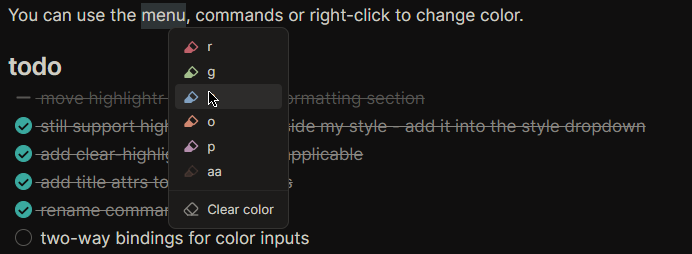
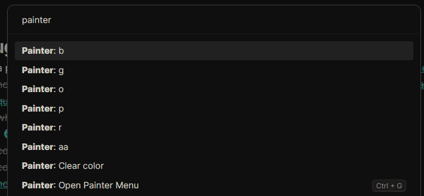

# Painter
> Paint text different colors  
  
  
  

Inspired by my [css snippet & data.json](https://github.com/chetachiezikeuzor/Highlightr-Plugin/issues/61) to use Highlightr to change text color.  
The aim of this plugin is to support most features of [Highlightr-Plugin](https://github.com/chetachiezikeuzor/Highlightr-Plugin) as well as changing of the text color.  

## Improvements over original plugin
### New features
- Added `text-color` higlight option
- Added `minimal` menu style - only show icons in one line (with `title` attributes)
- Smarter selection (adapted from [Smarter MD Hotkeys](https://github.com/chrisgrieser/obsidian-smarter-md-hotkeys))
  - `Inline code` signifies the part of the text being selected. `|` is a cursor without selection.
  - **Auto-select word:** "hello t`|`here world!" => "hello `there` world!"
  - **Trim selection to nearest word:** "what` is` up?" => "what `is` up?"
  - You are still able to paint a certain part of a word: "h`ell`o" => "h`ell`o"
- Better `Clear` (formerly `Remove higlight`) command
  - Added it to the highlighting menu as well	
  - In settings, you can configure custom CSS selectors to remove alongside any `mark` elements
  - Replaced regex-based approach with a `DOMParser`
- New svg icon (modified lucide highlighter icon)
- Added dynamic highlight preview in settings (shows with your colors)
  
### Fixes
- [Works in Obsidian's Table editor](https://github.com/chetachiezikeuzor/Highlightr-Plugin/issues/90)
- [Removed extra spaces after marks](https://github.com/chetachiezikeuzor/Highlightr-Plugin/pull/40)
- Allows overwriting previous highlights (setting) - similar to this [pull request](https://github.com/chetachiezikeuzor/Highlightr-Plugin/pull/63)
- Highlightr styles now use css variables instead of hardcoded values
  
### Other
- Cleaned up file structure & move to esbuild instead of rollupk
- Removed a bunch of unnecessary code & styles, overall cleanup & rewrite
  - Removed a bunch of custom icons in favor of normal obsidian icons	
  - Removed `wait()` calls (promise + settimeout)	
- Removed dependencies:
  - `pickr` - Replaced with obsidian's native color picker & an alpha slider
- Renamed command ids for consistency
- Rewrote basically the entire plugin lol

## Support plugin development
If you find this Plugin helpful, consider it's further development or just say a small thank you  
 
  
## Credits
- [Highlightr-Plugin](https://github.com/chetachiezikeuzor/Highlightr-Plugin) released under [MPLv2](./LICENSE) license. support: [ko-fi](https://ko-fi.com/chetachi)
  - for most of the original source code (most has been rewritten)
- [Smarter MD Hotkeys](https://github.com/chrisgrieser/obsidian-smarter-md-hotkeys) released under [MIT](https://github.com/chrisgrieser/obsidian-smarter-md-hotkeys/blob/master/LICENSE) license. support: [ko-fi](https://ko-fi.com/pseudometa)
  - for smart text modification logic

## TODO before release on Plugin Store
- [ ] two way binding for color inputs (editing input box updates color picker/slider)
- [x] fullly replace remaining innerHTML calls
  - don't worry, nothing sketchy is going on but it's a plugin guideline to not use `.innerHTML`. 
  - if unsure, you can check the source code for `innerHTML` usage
- [ ] allow editing of colors
- [ ] auto-generated classnames (maybe)
- [ ] replace remaining mentions of highlightr in code except for injected classnames
  - to be compatible with previously-highlighted notes by highlightr
  
## What this plugin doesen't try to be
This plugin is for coloring/highlighting text.  
It doesen't try to provide a comprehensive formatting toolbar/experience. 
Out of scope: [Modal highlighting (highlighting brushes)](https://github.com/chetachiezikeuzor/Highlightr-Plugin/issues/82)  
Use this: [obsidian-editing-toolbar](https://github.com/PKM-er/obsidian-editing-toolbar)  